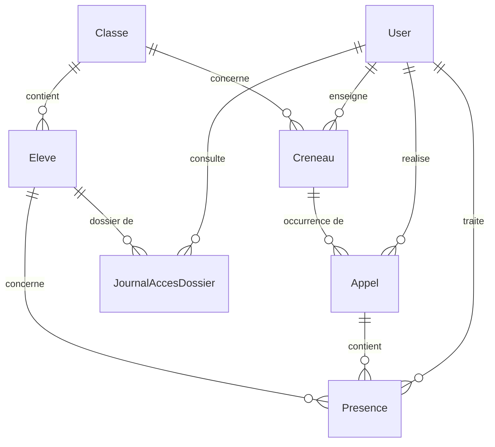

# Modèle de données — Assiduo v1

## Le point délicat : créneau vs appel

Un **créneau** est un gabarit hebdomadaire récurrent (ex. "6°A, mathématiques, tous les lundis
8h-9h avec M. Dupont"). Il ne porte aucune donnée de présence.

Un **appel** est une occurrence datée d'un créneau (ex. "le créneau du lundi 8h-9h, pour la date
du 14 septembre 2026"). C'est l'appel qui porte les présences des élèves, son horodatage de
validation et son verrouillage. Un même créneau donne lieu à un appel distinct chaque semaine,
créé à la demande (l'enseignant ouvre son créneau du jour, l'appel est créé s'il n'existe pas
encore pour cette date).

Cette séparation évite de confondre "le cours qui a lieu chaque semaine" et "ce qui s'est
réellement passé un jour donné" — un enseignant absent un jour, un cours qui saute une semaine,
ou une classe qui change de salle ne doivent pas polluer le gabarit.

## Entités

### User
Compte de connexion, commun aux quatre rôles.
- `id`, `email` (unique), `password` (haché), `nom`, `prenom`
- `roles` (tableau JSON) : `ROLE_ENSEIGNANT`, `ROLE_VIE_SCOLAIRE`, `ROLE_DIRECTION`, `ROLE_ADMIN`

### Classe
- `id`, `nom` (ex. "6°A")

### Eleve
- `id`, `nom`, `prenom`, `dateNaissance` (nullable)
- `classe` → Classe (ManyToOne)

### Creneau (gabarit hebdomadaire)
- `id`, `matiere`, `jourSemaine` (1=lundi … 7=dimanche), `heureDebut`, `heureFin`
- `classe` → Classe (ManyToOne)
- `enseignant` → User (ManyToOne)

### Appel (occurrence datée d'un créneau)
- `id`, `date`, `statut` (`ouvert` | `verrouille`), `horodatageValidation` (nullable)
- `creneau` → Creneau (ManyToOne)
- `realisePar` → User (ManyToOne, nullable tant que non fait)
- contrainte d'unicité : (`creneau_id`, `date`)

### Presence (une ligne par élève par appel)
- `id`, `statut` (`present` | `absent` | `retard`), `dureeRetardMinutes` (nullable)
- `qualification` (`non_traite` | `justifiee` | `injustifiee`, défaut `non_traite`)
- `motif` (nullable), `justificatifTexte` (nullable)
- `traitePar` → User (ManyToOne, nullable), `dateTraitement` (nullable)
- `appel` → Appel (ManyToOne), `eleve` → Eleve (ManyToOne)
- contrainte d'unicité : (`appel_id`, `eleve_id`)

### JournalAccesDossier (RGPD — F5)
Trace chaque consultation du dossier d'un élève, y compris les tentatives refusées
(scénario de recette : enseignant qui tente d'accéder à une autre classe).
- `id`, `dateConsultation`, `autorise` (bool)
- `utilisateur` → User (ManyToOne), `eleve` → Eleve (ManyToOne)

## Diagramme

## Ce qui n'est volontairement pas modélisé (hors périmètre v1, §4.2)
- Espace responsable légal / dépôt de justificatif par un tiers
- Notifications par courriel
- Statistiques avancées / seuils de décrochage
- Purge automatique (la suppression sur demande de F5 reste une action manuelle déclenchée par l'administrateur)
