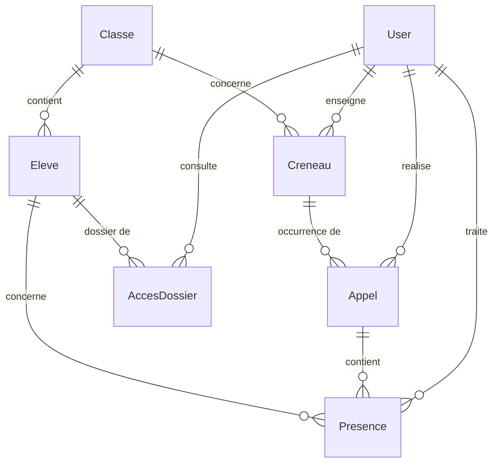

# Modèle de données — Assiduo v1

## Le point délicat : créneau vs appel

Un **créneau** est un gabarit hebdomadaire récurrent (ex. "4°B, mathématiques, tous les mardis
10h-11h, salle 12, avec M. Duval"). Il ne porte aucune donnée de présence.

Un **appel** est une occurrence datée d'un créneau (ex. "le créneau du mardi 10h-11h, pour la
date du 15 septembre 2026"). C'est l'appel qui porte les présences des élèves, son horodatage
de validation et son verrouillage. Un même créneau donne lieu à un appel distinct chaque
semaine, créé à la demande (l'enseignant ouvre son créneau du jour, l'appel est créé s'il
n'existe pas encore pour cette date).

Modéliser l'appel comme un simple attribut du créneau condamnerait l'application dès la
deuxième semaine de données (annexe technique §3.1) — d'où la contrainte d'unicité
`(creneau_id, date)` portée par `Appel`.

## Entités

### User
Compte de connexion, commun aux quatre rôles.
- `id`, `email` (unique), `password` (haché), `nom`, `prenom`
- `roles` (tableau JSON) : `ROLE_ENSEIGNANT`, `ROLE_VIE_SCOLAIRE`, `ROLE_DIRECTION`, `ROLE_ADMIN`

### Classe
- `id`, `nom` (ex. "4°B")

### Eleve
- `id`, `identifiantExterne` (unique) — clé métier stable de l'établissement, utilisée pour
  rendre l'import CSV idempotent (annexe §4) : ce n'est jamais l'auto-incrément qui sert de clé
  de rapprochement
- `nom`, `prenom`, `dateNaissance` (nullable)
- `classe` → Classe (ManyToOne)

### Creneau (gabarit hebdomadaire)
- `id`, `matiere`, `salle`, `jourSemaine` (1=lundi … 7=dimanche), `heureDebut`, `heureFin`
- `classe` → Classe (ManyToOne)
- `enseignant` → User (ManyToOne)

### Appel (occurrence datée d'un créneau)
- `id`, `date`, `statut` (`ouvert` | `verrouille`), `horodatageValidation` (nullable)
- `creneau` → Creneau (ManyToOne)
- `realisePar` → User (ManyToOne, nullable tant que non fait)
- contrainte d'unicité : (`creneau_id`, `date`)

### Presence (une ligne par élève par appel)
- `id`, `statut` (`present` | `absent` | `retard` | `exclu`), `dureeRetardMinutes` (nullable)
- `motif` (nullable), `justificatifTexte` (nullable)
- `justifiee` (booléen nullable) : `true` = justifiée, `false` = injustifiée, `null` = non
  encore traitée. Pas de colonne "qualification" séparée qui pourrait se désynchroniser :
  l'état "non traité" est simplement celui d'une absence dont `motif`/`justificatifTexte`/
  `traitePar`/`dateTraitement` sont encore vides (annexe §3.2) — c'est précisément ce qui
  alimente la file de traitement de la vie scolaire (F3).
- `traitePar` → User (ManyToOne, nullable), `dateTraitement` (nullable)
- `appel` → Appel (ManyToOne), `eleve` → Eleve (ManyToOne)
- contrainte d'unicité : (`appel_id`, `eleve_id`)

### AccesDossier (RGPD — F5)
Trace chaque consultation du dossier d'un élève, y compris les tentatives refusées
(scénario de recette : enseignant qui tente d'accéder à une autre classe). Alimentée par un
service explicite, plus un canal Monolog dédié (`acces_dossier`, voir
`config/packages/monolog.yaml`) qui écrit dans un fichier séparé (annexe §8).
- `id`, `dateConsultation`, `autorise` (bool)
- `utilisateur` → User (ManyToOne), `eleve` → Eleve (ManyToOne)

## Diagramme

## Écarts assumés par rapport au schéma illustratif de l'annexe (pas d'`Etablissement`
ni d'`Enseignant` séparé de `User`)

Voir [dossier-architecture.md](dossier-architecture.md#écarts-assumés-par-rapport-au-schéma-illustratif-de-lannexe-31).

## Ce qui n'est volontairement pas modélisé (hors périmètre v1, brief §4.2)
- Espace responsable légal / dépôt de justificatif par un tiers
- Notifications par courriel
- Statistiques avancées / seuils de décrochage
- Purge automatique (la suppression sur demande de F5 reste une action manuelle déclenchée par l'administrateur)
